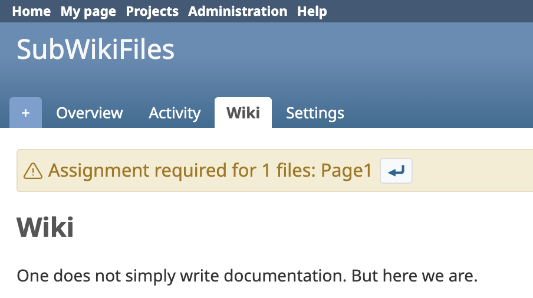
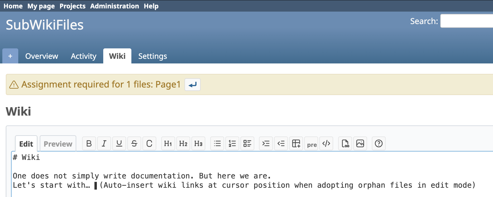
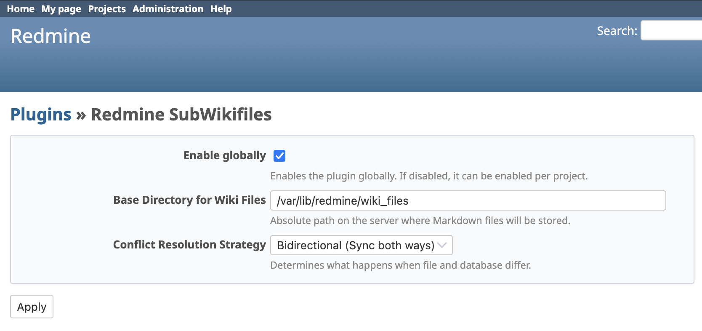

# Redmine Subwikifiles Plugin


A Redmine plugin that synchronises wiki pages bidirectionally with local Markdown files. Edit documentation in any editor you like — the plugin handles structure, detects new folders and orphan files, and versions changes automatically via Git.

> Built for teams that refuse to be locked into any platform. Your docs stay in your filesystem, in plain Markdown, forever.

## Screenshots





## Features

- **Bidirectional sync**: saving a wiki page writes to the filesystem; viewing reads from disk if the file is newer
- **Hierarchical structure**: wiki page hierarchy maps to folders on disk
- **Git integration**: automatically commits changes to a Git repository in the storage directory
- **Folder detection**: detects new folders and offers inline buttons to create subprojects or ignore them
- **Project inheritance**: new subprojects automatically inherit members, roles, enabled modules, and visibility from their parent
- **Orphan file handling**: detects files missing frontmatter and provides fix buttons
- **Attachment sync**: syncs attachments between Redmine and a local `_attachments` folder
- **Conflict detection**: configurable strategy when a file on disk is newer than the database record
- **Live UI updates**: sidebar navigation updates instantly on project creation without page reload

## Requirements

- Redmine 5.0 or higher
- A writable directory on the server for file storage
- Git (optional, for automatic versioning)

## Installation

> [!IMPORTANT]
> The plugin directory **MUST** be named `redmine_subwikifiles` for assets to load correctly.

1. **Clone** into your plugins directory:
   ```bash
   cd /path/to/redmine/plugins
   git clone https://github.com/subversive-tools/redmine_subwikifiles.git redmine_subwikifiles
   ```

2. **Restart Redmine**.

3. **Configure** the plugin under **Administration > Plugins > Subwikifiles > Configure**.

## Configuration

Navigate to **Administration > Plugins > Subwikifiles > Configure**.

| Option | Description | Default |
|:---|:---|:---|
| **Enabled** | Enable globally or per project | Disabled |
| **Base path** | Root directory for storing wiki files | `/var/lib/redmine/wiki_files` |
| **Git enabled** | Automatically commit changes to a Git repo in the storage directory | Disabled |
| **Conflict strategy** | Behaviour when the file on disk is newer than the database: `file_wins` or `manual` | `manual` |

> [!WARNING]
> **Filesystem permissions**: Redmine's role-based permissions are **not** propagated to the filesystem. Access to files on disk is governed solely by the OS user running Redmine.

## Directory structure

Files are stored under `{base_path}/{Project Name}/`. Subprojects map to subdirectories.

```
Project Name/
├── .project
├── Wiki.md
├── Parent_Page.md
│   └── Child_Page.md
├── _attachments/
│   └── Page_Title/
│       └── image.png
├── _orphaned/
└── Subproject Name/
    ├── .project
    └── Wiki.md
```

## Contributing

Contributions are welcome — please fork the repository and open a Pull Request.

1. Fork it
2. Create your feature branch (`git checkout -b feature/my-feature`)
3. Commit your changes
4. Push to the branch
5. Open a Pull Request

## License

[MIT License](LICENSE) — Copyright (c) 2026 Stefan Mischke
